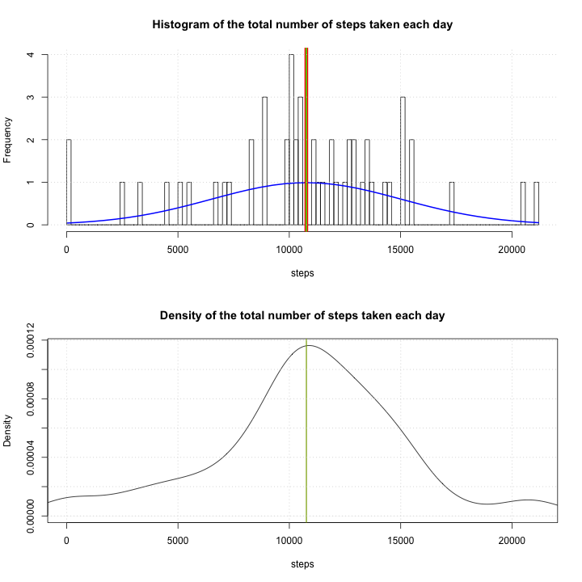
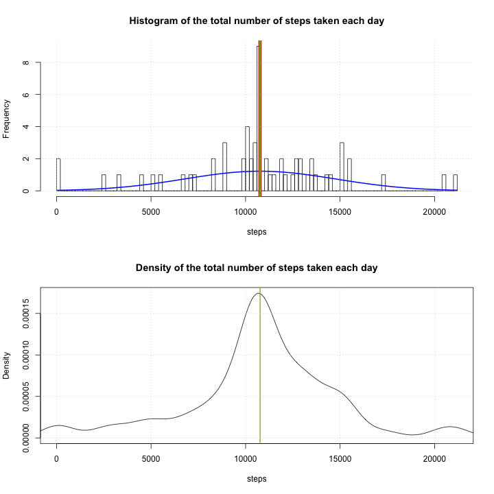
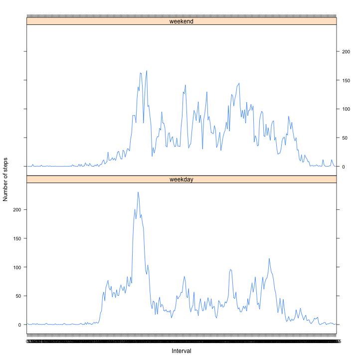
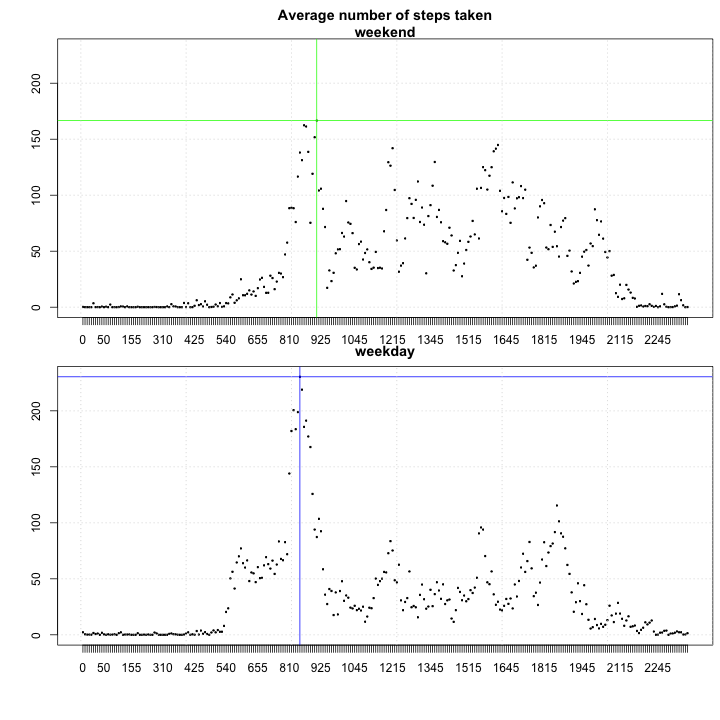
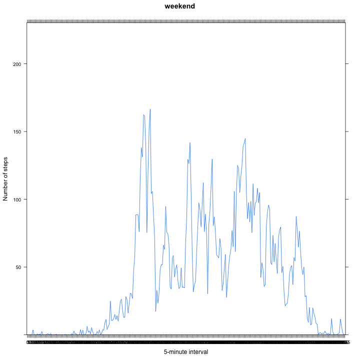
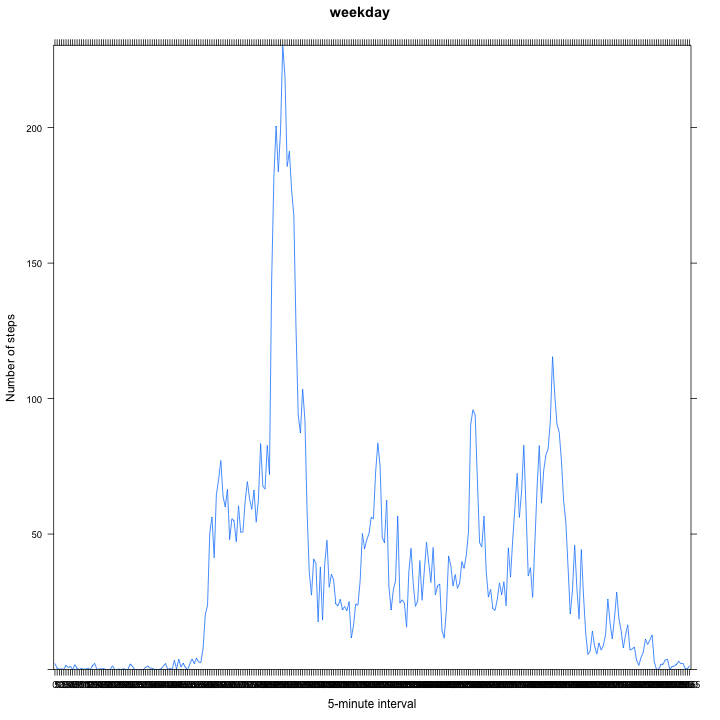

# Reproducible Research: Peer Assessment 1


## Loading and preprocessing the data

```r
activity <- read.csv("activity.csv", header = T)
nrow(activity)
```

```
## [1] 17568
```

There are, indeed, 17568 observation in this dataset, with the correct names
of the columns: steps, date, interval.  

I have done inline r calculations, that do not show in the html file after knitting (just the results of them),  
I will repeat those calcualtions in a r chunk for those interested how it was done.


```r
nrow(activity) # number of observations
```

```
## [1] 17568
```

```r
names(activity) # names of the columns
```

```
## [1] "steps"    "date"     "interval"
```

```r
head(activity)
```

```
##   steps       date interval
## 1    NA 2012-10-01        0
## 2    NA 2012-10-01        5
## 3    NA 2012-10-01       10
## 4    NA 2012-10-01       15
## 5    NA 2012-10-01       20
## 6    NA 2012-10-01       25
```

```r
tail(activity)
```

```
##       steps       date interval
## 17563    NA 2012-11-30     2330
## 17564    NA 2012-11-30     2335
## 17565    NA 2012-11-30     2340
## 17566    NA 2012-11-30     2345
## 17567    NA 2012-11-30     2350
## 17568    NA 2012-11-30     2355
```


## What is mean total number of steps taken per day?

1. Histogram of the total number of steps taken each day,  
     mean of the total number of steps is in red, median in green, normalized in blue.


```r
steps.day <- aggregate(steps ~ date, activity, sum)

par(mfrow = c(2, 1))
h <- hist(steps.day$steps, breaks=max(steps.day$steps)/250, xlab = "steps", main = "Histogram of the total number of steps taken each day")
xfit<-seq(min(steps.day$steps), max(steps.day$steps), length=40)
yfit<-dnorm(xfit, mean=mean(steps.day$steps), sd=sd(steps.day$steps))
yfit <- yfit*diff(h$mids[1:2])*length(steps.day$steps)
lines(xfit, yfit, col="blue", lwd=2)
abline(v = mean(steps.day$steps), col = "red", lwd = 6)
abline(v = median(steps.day$steps), col = "green", lwd =2)
grid()
plot(density(steps.day$steps), xlim = c(0, max(steps.day$steps)), xlab = "steps", main = "Density of the total number of steps taken each day")
abline(v = mean(steps.day$steps), col = "red", lwd = 1)
abline(v = median(steps.day$steps), col = "green", lwd =1)
grid()
```

 

2. Calculate and report the mean and median total number of steps taken per day

The mean of the total number of steps taken each day is mu = 1.0766 &times; 10<sup>4</sup>.

The median of the total number of steps taken each day is med = 10765.


```r
mean(steps.day$steps) # mu (mean)
```

```
## [1] 10766
```

```r
median(steps.day$steps) # med (median)
```

```
## [1] 10765
```

## What is the average daily activity pattern?

1. Make a time series plot (i.e. type = "l") of the 5-minute interval (x-axis) and the average number of steps taken, averaged across all days (y-axis)  
maximum number of steps is in red


```r
interval.mean <- aggregate(steps ~ interval, activity, mean)

interval.maxSteps <- interval.mean[interval.mean$steps == max(interval.mean$steps), ][1]
avg.maxSteps <- interval.mean[interval.mean$steps == max(interval.mean$steps), ][2]

par(mfrow = c(1,1))
plot(interval.mean$interval, interval.mean$steps, type = "l", xlab = "5-minute interval", ylab = "avg no. of steps taken averaged across all days", main = "Average number of steps taken")
abline(v = interval.maxSteps$interval, col = "red")
```

 

2. Which 5-minute interval, on average across all the days in the dataset, contains the maximum number of steps?

5-minute interval = 835 has the maximum number of steps, averaged across all the days, of avg_max_steps = 206.1698 steps.


```r
interval.maxSteps$interval # 5-minute interval that has the maximum number of steps
```

```
## [1] 835
```

```r
avg.maxSteps$steps # max number of steps
```

```
## [1] 206.2
```

## Imputing missing values

1. Calculate and report the total number of missing values in the dataset (i.e. the total number of rows with NAs)


```r
nrow(activity[is.na(activity), ]) # total number of rows with NAs
```

```
## [1] 2304
```

Total number of rows with NAs: 2304. 


```r
length(seq(0, 2355, 5)) # number of intervals in a day
```

```
## [1] 472
```

```r
length(seq(0, 2355, 5))*61 - nrow(activity) # the values that are not there
```

```
## [1] 11224
```

```r
length(seq(0, 2355, 5))*61 - nrow(activity) + nrow(activity[is.na(activity), ]) # NAs are added
```

```
## [1] 13528
```

But, that is not the whole story: some intervals are missing as well,
even though we are not required to calculate them and impute those missing values. 

Just for the sake of completeness:  
There are 61 days in our dataset, with 472 intervals, which gives us 2.8792 &times; 10<sup>4</sup> values for the full dataset.  
Because we have 17568 values (which includes NAs),
the number of the values that are really mising is 1.3528 &times; 10<sup>4</sup>.  

2. Devise a strategy for filling in all of the missing values in the dataset. The strategy does not need to be sophisticated. For example, you could use the mean/median for that day, or the mean for that 5-minute interval, etc.

The missing values are steps across several days, for each interval within the day.  
I have decided to replace the missing steps for each interval with the mean value for that particular interval. The first step is to index missing values, the second one to factorize intervals (instead of originally having integer value), the third one to replace missing steps with the mean of steps for that particular interval, row by row indexed by missing values.

3. Create a new dataset that is equal to the original dataset but with the missing data filled in.


```r
activity$interval <- factor(activity$interval)
missing_steps <- is.na(activity$steps)
activity[missing_steps, "steps"] <- interval.mean[activity[missing_steps, "interval"], "steps"]
head(activity)
```

```
##     steps       date interval
## 1 1.71698 2012-10-01        0
## 2 0.33962 2012-10-01        5
## 3 0.13208 2012-10-01       10
## 4 0.15094 2012-10-01       15
## 5 0.07547 2012-10-01       20
## 6 2.09434 2012-10-01       25
```

```r
tail(activity)
```

```
##        steps       date interval
## 17563 2.6038 2012-11-30     2330
## 17564 4.6981 2012-11-30     2335
## 17565 3.3019 2012-11-30     2340
## 17566 0.6415 2012-11-30     2345
## 17567 0.2264 2012-11-30     2350
## 17568 1.0755 2012-11-30     2355
```

```r
nrow(activity)
```

```
## [1] 17568
```

Previously, both head and tail of the dataset had NAs, but now everything is correct, with the same number of rows 17568 as the original dataset (with NAs).  

4. Make a histogram of the total number of steps taken each day. What is the impact of imputing missing data on the estimates of the total daily number of steps?

The days that had missing values now have the mean number of steps in them, making the histogram taller at the mean/median point, but the spread is the same.


```r
steps.day <- aggregate(steps ~ date, activity, sum)

par(mfrow = c(2, 1))
h <- hist(steps.day$steps, breaks=max(steps.day$steps)/250, xlab = "steps", main = "Histogram of the total number of steps taken each day")
xfit<-seq(min(steps.day$steps), max(steps.day$steps), length=40)
yfit<-dnorm(xfit, mean=mean(steps.day$steps), sd=sd(steps.day$steps))
yfit <- yfit*diff(h$mids[1:2])*length(steps.day$steps)
lines(xfit, yfit, col="blue", lwd=2)
abline(v = mean(steps.day$steps), col = "red", lwd = 6)
abline(v = median(steps.day$steps), col = "green", lwd =2)
grid()
plot(density(steps.day$steps), xlim = c(0, max(steps.day$steps)), xlab = "steps", main = "Density of the total number of steps taken each day")
abline(v = mean(steps.day$steps), col = "red", lwd = 1)
abline(v = median(steps.day$steps), col = "green", lwd =1)
grid()
```

 

Calculate and report the mean and median total number of steps taken per day. Do these values differ from the estimates from the first part of the assignment?  

The mean of the total number of steps taken each day is mu = 1.0766 &times; 10<sup>4</sup>.

The median of the total number of steps taken each day is med = 1.0766 &times; 10<sup>4</sup>.

Mean and median are now the same, while previously median was 1 step less than the mean.  


```r
mean(steps.day$steps) # mu (mean)
```

```
## [1] 10766
```

```r
median(steps.day$steps) # med (median)
```

```
## [1] 10766
```
  
## Are there differences in activity patterns between weekdays and weekends?

1. Create a new factor variable in the dataset with two levels – “weekday” and “weekend” indicating whether a given date is a weekday or weekend day.


```r
str(activity)
```

```
## 'data.frame':	17568 obs. of  3 variables:
##  $ steps   : num  1.717 0.3396 0.1321 0.1509 0.0755 ...
##  $ date    : Factor w/ 61 levels "2012-10-01","2012-10-02",..: 1 1 1 1 1 1 1 1 1 1 ...
##  $ interval: Factor w/ 288 levels "0","5","10","15",..: 1 2 3 4 5 6 7 8 9 10 ...
```

```r
myDate <- as.Date(activity$date) #change the datatype into date type

weekDay <- weekdays(myDate) # get the names of each day
weekday.activity <- cbind(activity, weekDay) # add a column with the names of the day
levels(weekday.activity$weekDay) # check the levels
```

```
## [1] "Friday"    "Monday"    "Saturday"  "Sunday"    "Thursday"  "Tuesday"  
## [7] "Wednesday"
```

Change the levels of added column from names of the day into just "weekend" or "weekday", depending on the name of the day (Saturdays and Sundays are weekend, other days are weekday).


```r
levels(weekday.activity$weekDay) <- list(weekday="Friday", weekday="Monday", weekend="Saturday", weekend="Sunday", weekday="Thursday", weekday="Tuesday", weekday="Wednesday")
levels(weekday.activity$weekDay) # check the levels now
```

```
## [1] "weekday" "weekend"
```

Look at the dataset with the added factor variable.


```r
head(weekday.activity)
```

```
##     steps       date interval weekDay
## 1 1.71698 2012-10-01        0 weekday
## 2 0.33962 2012-10-01        5 weekday
## 3 0.13208 2012-10-01       10 weekday
## 4 0.15094 2012-10-01       15 weekday
## 5 0.07547 2012-10-01       20 weekday
## 6 2.09434 2012-10-01       25 weekday
```

```r
tail(weekday.activity)
```

```
##        steps       date interval weekDay
## 17563 2.6038 2012-11-30     2330 weekday
## 17564 4.6981 2012-11-30     2335 weekday
## 17565 3.3019 2012-11-30     2340 weekday
## 17566 0.6415 2012-11-30     2345 weekday
## 17567 0.2264 2012-11-30     2350 weekday
## 17568 1.0755 2012-11-30     2355 weekday
```

2. Make a panel plot containing a time series plot (i.e. type = "l") of the 5-minute interval (x-axis) and the average number of steps taken, averaged across all weekday days or weekend days (y-axis).

The panel plot similar to the one on the assignment page.


```r
library(lattice)
steps.byWeekDay <- aggregate(steps ~ interval + weekDay, weekday.activity, mean)
xyplot(steps ~ interval | weekDay, steps.byWeekDay, type = "l", xlab = "Interval", ylab = "Number of steps", layout = c(1, 2))
```

 

Doing the same thing in Base Graphics, just for the fun of it.


```r
weekend <- subset(weekday.activity, weekDay == "weekend")
weekday <- subset(weekday.activity, weekDay == "weekday")

interval.mean.weekend <- aggregate(steps ~ interval, weekend, mean)
interval.mean.weekday <- aggregate(steps ~ interval, weekday, mean)

interval.maxStepsE <- interval.mean.weekend[interval.mean.weekend$steps == max(interval.mean.weekend$steps), ][1]
avg.maxStepsE <- interval.mean.weekend[interval.mean.weekend$steps == max(interval.mean.weekend$steps), ][2]

interval.maxStepsW <- interval.mean.weekday[interval.mean.weekday$steps == max(interval.mean.weekday$steps), ][1]
avg.maxStepsW <- interval.mean.weekday[interval.mean.weekday$steps == max(interval.mean.weekday$steps), ][2]

par(mfrow = c(1, 1))
def.par <- par(no.readonly = T) # save default

par(mfrow = c(2,1))
par(mar = c(1.2, 0, 2.2, 0), oma = c(4, 4, 0.5, 0.5))
plot(interval.mean.weekend$interval, interval.mean.weekend$steps, type = "l", xlab = "5-minute interval", ylab = "Number of steps", main = "Average number of steps taken\nweekend", ylim = c(0,max(interval.mean.weekday$steps)), col = "green")
abline(v = interval.maxStepsE$interval, h= avg.maxStepsE$steps, col = "green")
grid()
plot(interval.mean.weekday$interval, interval.mean.weekday$steps, type = "l", xlab = "5-minute interval", ylab = "Number of steps", main = "weekday", ylim = c(0,max(interval.mean.weekday$steps)), col = "blue")
abline(v = interval.maxStepsW$interval, h= avg.maxStepsW$steps, col = "blue")
grid()
```

 
  
restore default plot parameters par()


```r
par(def.par) # reset to default
```

plot function does not plot lines correctly (even though it is instructed with type = "l"),  
so I'll repeat the plot, this time in lattice package.


```r
xyplot(interval.mean.weekend$steps ~ interval.mean.weekend$interval, type = "l", xlab = "5-minute interval", ylab = "Number of steps", main = "weekend", ylim = c(0,max(interval.mean.weekday$steps)))
```

 

```r
xyplot(interval.mean.weekday$steps ~ interval.mean.weekday$interval, type = "l", xlab = "5-minute interval", ylab = "Number of steps", main = "weekday", ylim = c(0,max(interval.mean.weekday$steps)))
```

 

On the weekends, the maximum no. of steps occurs at 09:15, 166.64 of them. The mean is  42.3664 steps.  

On the weekdays, the maximum no. of steps occurs at 08:35, 230.38 of them. The mean is 35.6106 steps.


```r
interval.maxStepsE
```

```
##     interval
## 112      915
```

```r
avg.maxStepsE
```

```
##     steps
## 112 166.6
```

```r
mean(interval.mean.weekend$steps)
```

```
## [1] 42.37
```

```r
interval.maxStepsW
```

```
##     interval
## 104      835
```

```r
avg.maxStepsW
```

```
##     steps
## 104 230.4
```

```r
mean(interval.mean.weekday$steps)
```

```
## [1] 35.61
```
